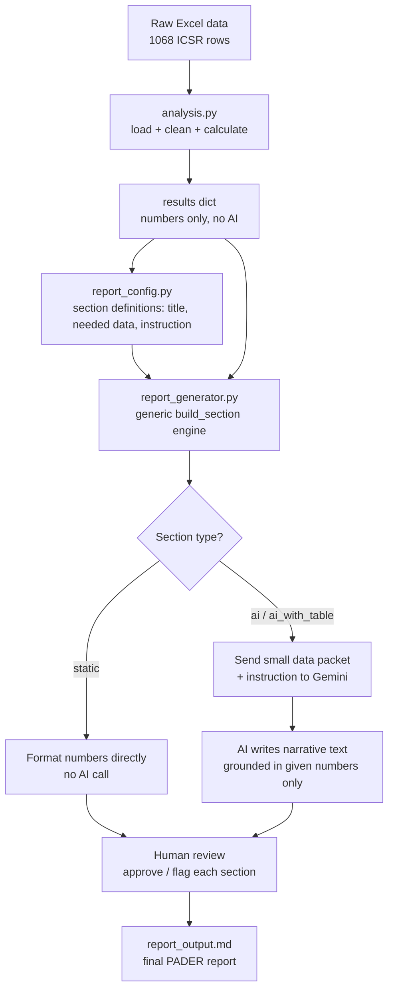

# Architecture Diagram

The main thing this shows: Gemini only ever gets reached through one
narrow path — a small packet of numbers I've already calculated, never
the raw dataset itself. Everything before that point (loading, cleaning,
calculating) is plain, deterministic Python — no AI involved at all.